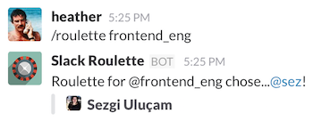

# Slack Roulette

This is the source of the Slack Roulette application hosted at
https://slack-roulette.herokuapp.com, which adds the `/roulette` command to
Slack. This will mention a random user from one of your team's user groups.

Example usage:



Since this is a bare-bones Slack OAuth application, it can also serve as an
easily modified template for new applications.

## Development

### Setup

Register a new Slack application: https://api.slack.com/applications/new

You'll need the **Client ID** and **Client Secret**.

Copy the config template and then fill out necessary values in `.env.development`:

```sh
cp .env.template .env.development
```

After your database configuration is in `.env.development`, prepare your
database by running:

```sh
rake db:migrate
```

To open an interactive console:
```sh
bin/console
```
